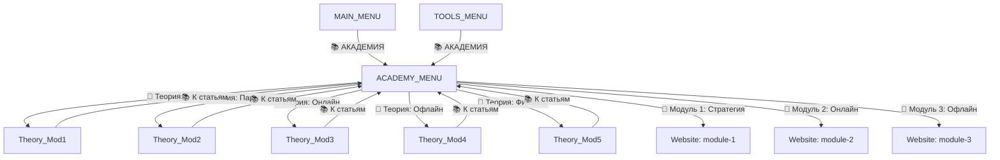

# Plan: Persistent Access to Academy Articles

## Problem

After completing training, users lose access to article links:

1. **MAIN_MENU** has no Academy/Articles button — once training is done, the user transitions to the main menu which only shows PRO tools, settings, instruments, profile, support
2. **TOOLS_MENU** has Promo-Kit, CRM, Knowledge Base, AI Apps — but **no article links**
3. **Theory modules** (Theory_Mod1–5) are inline bot text — once the user scrolls past, there is no structured way to re-read them
4. **Practical modules** (Module 1–3) have URL buttons to `ACADEMY_BASE_URL/module-{1,2,3}/` — but these buttons only appear when the user is ON that specific training step

## Solution: Add `ACADEMY_MENU` Hub Step

Create a dedicated **📚 АКАДЕМИЯ** menu step that serves as a permanent hub for all educational content. It is accessible from both `MAIN_MENU` and `TOOLS_MENU` at all times for registered users.

### Architecture



### ACADEMY_MENU Layout

**Text:** Dynamic message showing progress and listing all available content with ✅ markers for completed items.

**Buttons — Telegram:**

```
┌─────────────────────────────────────┐
│ 📖 ТЕОРИЯ: ЧТО ТАКОЕ SETHUBBLE  ✅ │  → callback: Theory_Mod1
├─────────────────────────────────────┤
│ 📖 ТЕОРИЯ: АРХИТЕКТУРА ПАРТНЁРОВ ✅│  → callback: Theory_Mod2
├─────────────────────────────────────┤
│ 📖 ТЕОРИЯ: ИНСТРУМЕНТЫ ОНЛАЙН   ✅ │  → callback: Theory_Mod3
├─────────────────────────────────────┤
│ 📖 ТЕОРИЯ: РЕШЕНИЯ ДЛЯ ОФЛАЙН  ✅ │  → callback: Theory_Mod4
├─────────────────────────────────────┤
│ 📖 ТЕОРИЯ: МАТЕМАТИКА БОГАТСТВА✅ │  → callback: Theory_Mod5
├─────────────────────────────────────┤
│ 🔗 МОДУЛЬ 1: СТРАТЕГИЯ         ✅ │  → url: ACADEMY_BASE_URL/module-1/
├─────────────────────────────────────┤
│ 🔗 МОДУЛЬ 2: ИИ-ВОРОНКИ        ✅ │  → url: ACADEMY_BASE_URL/module-2/
├─────────────────────────────────────┤
│ 🔗 МОДУЛЬ 3: ОФЛАЙН-СЕТИ       ✅ │  → url: ACADEMY_BASE_URL/module-3/
├─────────────────────────────────────┤
│ 🏠 В ГЛАВНОЕ МЕНЮ                  │  → callback: MAIN_MENU
└─────────────────────────────────────┘
```

✅ markers appear dynamically based on `user.session.theory_complete` and `user.session.mod{1,2,3}_done`.

### Changes Required

#### 1. `function_chat_bot/src/scenarios/common/texts.js`
- Add `ACADEMY_MENU` text — dynamic function that shows progress and lists all available content

#### 2. `function_chat_bot/src/scenarios/telegram/buttons.js`
- Add `ACADEMY_MENU` button layout with:
  - 5 callback buttons for Theory_Mod1–5 (re-display inline text)
  - 3 URL buttons for Module 1–3 academy articles
  - Back to MAIN_MENU button
- Add `📚 АКАДЕМИЯ` button to `MAIN_MENU` (for registered users, after the top action button)
- Add `📚 АКАДЕМИЯ` button to `TOOLS_MENU` (after Promo-Kit or locked items)

#### 3. `function_chat_bot/src/scenarios/vk/buttons.js`
- Same changes as telegram/buttons.js but using VK button format (callback instead of callback_data, url for links)

#### 4. `function_chat_bot/src/scenarios/common/step_meta.js`
- Add `ACADEMY_MENU` entry with appropriate image/tag

#### 5. `function_chat_bot/src/scenarios/common/step_order.js`
- Add `ACADEMY_MENU` to `FUNNEL_STEPS` array

#### 6. Theory step navigation update
- Optionally add `📚 К СТАТЬЯМ` button to Theory_Mod1–5 steps for easy return to ACADEMY_MENU
- This is a nice-to-have; the MAIN_MENU/TOOLS_MENU entry points may be sufficient

### Entry Points to ACADEMY_MENU

| Location | When Visible | Button Text |
|----------|-------------|-------------|
| MAIN_MENU | Always (registered users) | 📚 АКАДЕМИЯ |
| TOOLS_MENU | Always (registered users) | 📚 АКАДЕМИЯ |
| Theory_Mod1–5 | Optional enhancement | 📚 К СТАТЬЯМ |

### Key Design Decisions

1. **Theory modules use callback buttons** (not URL) because they are inline bot text — clicking re-displays the message in chat
2. **Practical modules use URL buttons** because they link to external academy articles on the website
3. **ACADEMY_MENU is always accessible** regardless of training progress — users can preview upcoming content
4. **✅ completion markers** provide visual feedback without restricting access
5. **No new YDB schema changes** needed — we use existing `user.session.theory_complete`, `mod1_done`, `mod2_done`, `mod3_done` flags
