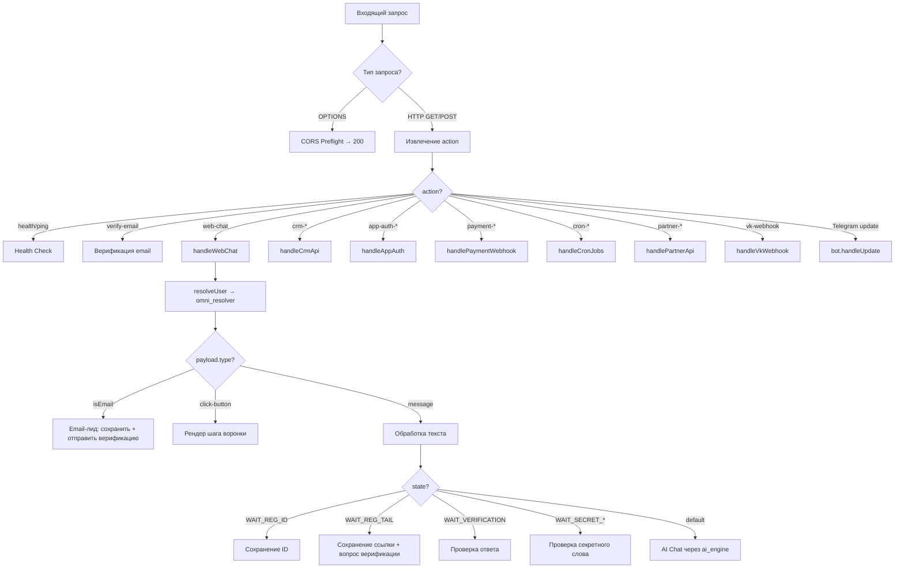
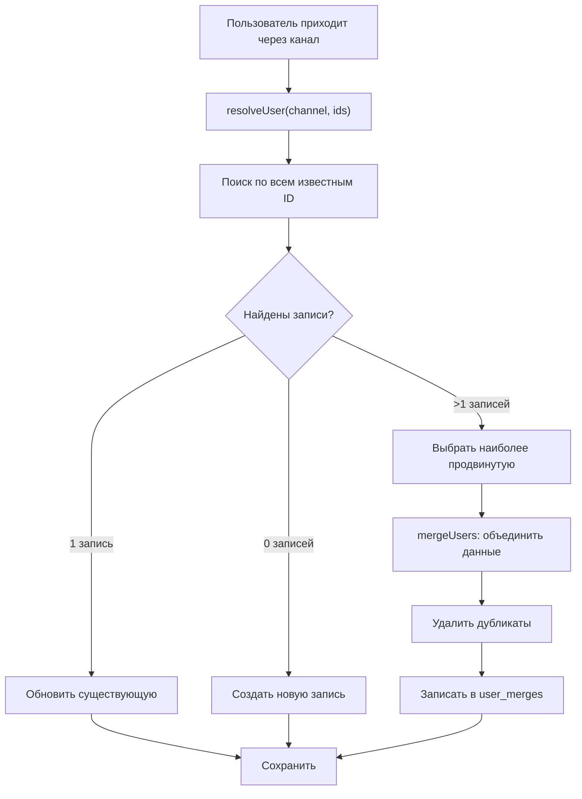

# NeuroGen Platform — Полный анализ приложения

**Дата:** 2026-04-28
**Версия:** v6.0 (Омниканальная) / v7.0 (AI-конструктор)
**Статус:** 🟢 Production

---

## 1. Общее описание

**NeuroGen Platform** — SaaS-платформа для создания Telegram/VK ботов с AI-консультантом и автоматизированной воронкой продаж для экосистемы SetHubble.

**Стек технологий:**
| Компонент | Технология |
|-----------|-----------|
| Рантайм | Node.js ≥20, ESM-модули |
| Хостинг бота | Yandex Cloud Functions (serverless) |
| База данных | YDB (Yandex Database) |
| Telegram | Telegraf v4 |
| VK | VK Callback API v5.199 |
| Email | Yandex Postbox API v2 + AWS SigV4 |
| AI | OpenRouter API / Polza.ai |
| Сайт | Eleventy v3 + Tailwind CSS v4 |
| Аутентификация | JWT + Telegram WebApp initData |
| Деплой | YC CLI, zip-архив |

---

## 2. Структура проекта

```
neurogen-platform/
├── function_chat_bot/          # ☁️ Serverless-функция (основной бэкенд)
│   ├── index.js                # Entry point: HTTP handler, CRON, rate limiting
│   ├── ai_engine.js            # AI-движок: OpenRouter/Polza, карта знаний, эмоциональный анализ
│   ├── ydb_helper.js           # YDB SDK wrapper: CRUD, merge, дедупликация
│   ├── ydb_schema.sql          # Схема БД (v6.0 омниканальная)
│   ├── package.json            # Зависимости: telegraf, ydb-sdk, jsonwebtoken, lru-cache
│   └── src/
│       ├── core/
│       │   ├── channels/
│       │   │   └── channel_manager.js    # Мультиканальная оркестрация
│       │   ├── email/
│       │   │   └── email_service.js      # Email-сервис (Postbox API)
│       │   ├── omni_resolver.js          # Омниканальный резолвер пользователей
│       │   └── http_handlers/
│       │       ├── web_chat.js           # Web-чат: лиды, воронка, AI
│       │       ├── crm_api.js            # CRM API для владельцев ботов
│       │       ├── app_auth.js           # Аутентификация приложений
│       │       ├── payment_webhook.js    # Платежные вебхуки
│       │       ├── cron_jobs.js          # CRON: дожимы, напоминания
│       │       └── partner_api.js        # API партнеров
│       ├── platforms/
│       │   ├── telegram/
│       │   │   ├── telegram_setup.js     # Настройка Telegram-обработчиков
│       │   │   └── telegram_actions.js   # Действия Telegram
│       │   └── vk/
│       │       └── vk_handler.js         # Обработчик VK webhook
│       ├── scenarios/
│       │   ├── scenario_tg.js            # Сценарий воронки Telegram
│       │   ├── scenario_vk.js            # Сценарий воронки VK
│       │   └── common/                   # Общие утилиты сценариев
│       │       ├── constants.js          # Константы
│       │       ├── deeplink.js           # Глубокие ссылки
│       │       ├── get_links.js          # Генерация ссылок
│       │       ├── step_meta.js          # Метаданные шагов
│       │       ├── step_order.js         # Порядок шагов + адаптация под канал
│       │       └── texts.js              # Тексты шагов
│       └── utils/
│           ├── validator.js              # Валидация: email, user_id, XSS
│           ├── logger.js                 # Логирование с trace_id
│           ├── jwt_utils.js              # JWT: генерация/верификация
│           ├── retry.js                  # Retry-логика
│           ├── ttl_cache.js              # TTL-кэш в памяти
│           ├── ux_helpers.js             # UX-хелперы
│           ├── pin.js                    # Генерация PIN-кодов
│           ├── webhook_retry.js          # Retry для вебхуков
│           └── db_migrations.js          # Авто-миграции БД
│
├── website/                     # 🌐 Статический сайт (Eleventy)
│   ├── eleventy.config.js       # Конфигурация Eleventy
│   ├── package.json             # Eleventy + Tailwind CSS
│   └── src/
│       ├── index.html           # Главная страница
│       ├── join.njk             # Лендинг с формой email
│       ├── ai.njk               # Web-чат / воронка на сайте
│       ├── _includes/           # Шаблоны и паршалы
│       ├── content/             # Контент: блог, новости, академия
│       ├── css/                 # Стили (Tailwind)
│       └── js/                  # Клиентский JS: калькулятор, частицы, метрика
│
├── tools/                       # 🛠 HTML-инструменты
│   ├── crm_dashboard.html       # CRM-дашборд
│   ├── crm_demo.html            # Демо CRM
│   └── promo-kit-v2.html        # Promo Kit v2
│
└── docs/                        # 📚 Документация
    ├── AI_CONTEXT_BRIEF.md      # Краткий контекст для разработчика/ИИ
    ├── DEPLOY_GUIDE.md          # Инструкция по деплою
    ├── OMNICHANNEL_ANALYSIS.md  # Анализ омниканальной склейки
    ├── QWEN.md                  # Полная документация
    └── AGENTS.md                # Правила для AI-агентов
```

---

## 3. Архитектура базы данных (YDB v6.0)

### 3.1 Таблица `users`

Переход от префиксных `user_id` (`vk:123`, `email:user@...`) к UUID Primary Key с отдельными колонками для каждого канала.

| Колонка | Тип | Назначение |
|---------|-----|-----------|
| `id` | Utf8 | 🔑 UUID v4 — первичный ключ |
| `email` | Utf8 | Email (клей для объединения каналов) |
| `tg_id` | Uint64 | Telegram ID |
| `vk_id` | Uint64 | VK ID |
| `web_id` | Utf8 | Web session ID |
| `partner_id` | Utf8 | Реферальный хвост |
| `state` | Utf8 | Текущий шаг воронки |
| `bought_tripwire` | Bool | Куплен ли PRO |
| `session` | Json | dialog_history, tags, channel_states, XP |
| `last_seen` | Uint64 | Timestamp последней активности |
| `session_version` | Uint64 | Защита от race condition |
| `ai_active_until` | Uint64 | TTL ИИ-подписки |
| `custom_api_key` | Utf8 | Личный API-ключ партнера |
| `custom_prompt` | Utf8 | Кастомный системный промпт |
| `ai_model` | Utf8 | Модель ИИ |
| `ai_provider` | Utf8 | Провайдер (polza/openrouter) |
| `user_daily_limit` | Uint64 | Дневной лимит на лида |

**Индексы:** `email`, `tg_id`, `vk_id`, `web_id`, `bot_token`, `partner_id`, `bought_tripwire`, `last_seen`

### 3.2 Таблица `user_merges`

Append-only аудит слияний профилей:
- `surviving_user_id` — кто остался
- `deleted_user_id` — кто поглощен
- `merge_reason` — причина (email_match, web_merge, tg_merge, vk_merge, manual)

### 3.3 Таблица `bots`

Конфигурация ботов партнеров (v7.0 — добавлены AI-колонки):
- `bot_token`, `user_id`, `bot_username`, `sh_user_id`, `sh_ref_tail`
- `ai_provider`, `ai_model`, `custom_api_key`, `custom_prompt`, `user_daily_limit`

### 3.4 Таблица `processed_updates`

Дедупликация Telegram webhook update'ов с TTL-автоудалением.

### 3.5 Таблица `link_clicks`

Аналитика переходов по реферальным ссылкам.

---

## 4. Поток обработки запросов



---

## 5. Омниканальная архитектура

### 5.1 Формат ссылок между каналами

| Канал | Формат ссылки |
|-------|---------------|
| Telegram | `https://t.me/bot?start=p_qdr__web_abc123__emailB64` |
| VK | `https://vk.me/group?ref=p_qdr__web_abc123__emailB64` |
| Web | `/ai/?ref=p_qdr&session_id=web_abc123&email=user@mail.ru` |

Разделитель: `__` (безопасен для Telegram/VK, не конфликтует с partner_id)

### 5.2 Алгоритм склейки (`omni_resolver.js`)



### 5.3 Channel Manager

Управляет конфигурациями каналов в `session.channels` и `session.channel_states`:

- **Приоритет отправки:** Telegram > VK > Email > Web
- **Авто-детект:** если заполнены `tg_id`/`vk_id`/`web_id`/`email` → канал помечается как configured
- **Состояния:** per-channel funnel state (можно быть на разных шагах в разных каналах)

---

## 6. AI Engine (v3.0)

### 6.1 Архитектура

AI Engine построен вокруг карты знаний (`KNOWLEDGE_MAP`) — ИИ знает только то, что пользователь уже прошел по воронке:

- **До регистрации:** общее описание, основные понятия
- **Теория (5 модулей):** архитектура, партнеры, онлайн, офлайн, бинар/компрессия
- **Бесплатное обучение:** стратегия, онлайн-бизнес, офлайн-бизнес
- **PRO-обучение:** дизайн, сайты, боты, полный курс
- **Тарифы:** Rocket, Shuttle

### 6.2 Эмоциональный анализ

Определяет тональность сообщения по ключевым словам:
- **positive** → enthusiastic tone
- **negative** → OBJECTION prompt
- **doubt** → OBJECTION prompt
- **question** → informative tone
- **buying** → HOT_LEAD prompt

### 6.3 Системные промпты

| Промпт | Когда применяется |
|--------|------------------|
| `BASE` | По умолчанию |
| `OBJECTION` | Возражения, сомнения |
| `HOT_LEAD` | Готовность к покупке |
| `COLD_LEAD` | Неактивность >24ч |
| `SUPPORT` | Технические вопросы |

### 6.4 Провайдеры

- **Polza.ai** (`https://polza.ai/api/v1`) — основной
- **OpenRouter** (`https://openrouter.ai/api/v1`) — альтернативный
- Модель по умолчанию: `openai/gpt-4o-mini`
- Таймаут: 15 секунд
- max_tokens: 200

---

## 7. Воронка продаж (Sales Funnel)

### 7.1 Основные этапы

```
START → Start_Choice → [Agent_1_Pain / Business_Online_Pain / Business_Offline_Pain]
→ Pre_Training_Logic → Theory_Mod1..5 → Training_Main
→ Module_1_Strategy → Module_2_Online → Module_3_Offline
→ Lesson_Final_Comparison → Offer_Tripwire → FAQ_PRO
→ Delivery_1 → Training_Pro_Main → Training_Pro_P1_1..P2_4
→ Shuttle_Offer → Rocket_Limits
```

### 7.2 Система дожимов (DOZHIM_MAP)

10-шаговая последовательность с нарастающими интервалами:

| Этап | Задержка |
|------|---------|
| Offer_Tripwire → FollowUp_1 | 50 часов |
| FollowUp_1 → FollowUp_2 | 24 часа |
| FollowUp_2 → FollowUp_3 | 48 часов |
| ... | ... |
| FollowUp_9 → FollowUp_10 | 216 часов (9 дней) |
| FollowUp_10 → FollowUp_Plan_1 | 168 часов (неделя) |

Аналогичная цепочка для тарифов (Rocket/Shuttle).

### 7.3 Напоминания (REMIND_MAP)

Для ключевых шагов (обучение, ожидание ввода) отправляются напоминания с интервалами: 1ч, 3ч, 24ч, 48ч.

---

## 8. Ключевые константы и лимиты

| Параметр | Значение | Назначение |
|----------|---------|-----------|
| `RATE_LIMIT_MAX` | 60 req/min | Rate limiting на IP |
| `CRON_MAX_USERS_PER_RUN` | 200 | Макс. пользователей за CRON-цикл |
| `DOZHIM_DELAY_HOURS` | 20 | Базовая задержка дожима |
| `AI_FREE_LIMIT` | 3 | Бесплатных AI-ответов в день |
| `AI_PRO_LIMIT` | 30 | PRO AI-ответов в день |
| `MAX_RETRIES` | 2 | Попыток отправки сообщения |
| `MAX_RETRY_DELAY_SEC` | 10 | Макс. задержка retry |
| `BROADCAST_RATE_LIMIT` | 30 | Сообщений в пачке рассылки |
| `CRON_STALE_HOURS` | 1 | Неактивность для CRON |
| `PRODUCT_ID_FREE` | `140_9d5d2` | Бесплатный продукт |
| `PRODUCT_ID_PRO` | `103_97999` | PRO ($20 со скидкой) |

---

## 9. Безопасность

| Механизм | Реализация |
|----------|-----------|
| Rate Limiting | In-memory Map по IP, 60 req/min |
| Дедупликация | YDB `processed_updates` + in-memory Map |
| Валидация | `validator.js`: email, user_id, XSS (escapeHtml) |
| Аутентификация | JWT + Telegram WebApp initData (HMAC-SHA256) |
| Авторизация CRM | Проверка владельца бота + PRO-статус + глобальные админы |
| CORS | `Access-Control-Allow-Origin: *` |
| Graceful Degradation | Функция не падает при ошибках YDB |
| Retry | Webhook retry (5s → 30s), RESOURCE_EXHAUSTED retry |

---

## 10. Известные проблемы и риски

### 10.1 Race Condition в Telegram
**Симптом:** Две строки с одинаковым `tg_id`
**Причина:** Telegram может отправить несколько запросов одновременно (callback + message). Оба видят «пользователь не найден» и создают новые строки.
**Статус:** Частично решено через `processed_updates` в YDB, но in-memory `processedUpdates` не помогает при разных инстансах.

### 10.2 Органические запуски без payload
**Симптом:** Создается изолированная строка без привязки к web_id/email
**Причина:** Пользователь нажимает `/start` без payload (из поиска, organic)
**Вероятность:** Высокая

### 10.3 VK state handling
**Симптом:** Возможен сброс state при определенных сценариях
**Статус:** Логика `if (!vkUser.state)` защищает от перезаписи, но краевые случаи возможны

### 10.4 In-memory state в serverless
**Проблема:** `rateLimitMap`, `processedUpdates`, `isMainBotMenuSet` живут в памяти инстанса функции. При холодном старте или масштабировании состояние теряется.
**Влияние:** Низкое (rate limiting не критичен, дедупликация дублируется в YDB)

---

## 11. Процесс деплоя

```bash
# 1. Проверка синтаксиса
cd function_chat_bot && npm run check

# 2. Создание zip-архива (без node_modules)
npm run deploy

# 3. Загрузка в Yandex Cloud Function
yc serverless function version create \
  --function-name sethubble-bot \
  --runtime nodejs20 \
  --entrypoint index.handler \
  --source-path function.zip \
  --environment BOT_TOKEN=...,YDB_ENDPOINT=...,...

# 4. Проверка логов
yc serverless function logs --function-name sethubble-bot --tail 50
```

---

## 12. Метрики и мониторинг

- **Health Check:** `?action=health` → статус YDB, uptime, memory, version
- **Trace ID:** `x-request-id` или авто-генерация UUID для каждого запроса
- **Логи:** структурированные с префиксами `[WEB LEAD]`, `[TG]`, `[VK]`, `[AI ENGINE]`, `[CRON]`
- **API Version:** заголовок `X-API-Version: v1`

---

## 13. Резюме

**Сильные стороны:**
- Продуманная омниканальная архитектура с корректной склейкой профилей
- AI Engine с картой знаний, не допускающий спойлеров и галлюцинаций
- Многоуровневая защита: rate limiting, дедупликация, валидация, retry
- Graceful degradation — система не падает при отказе зависимостей
- Хорошая структура кода с разделением на модули

**Зоны для улучшения:**
- Race condition при одновременных запросах Telegram
- In-memory state в serverless окружении
- Отсутствие мониторинга/алертинга (кроме логов)
- Органические запуски без payload создают изолированные записи