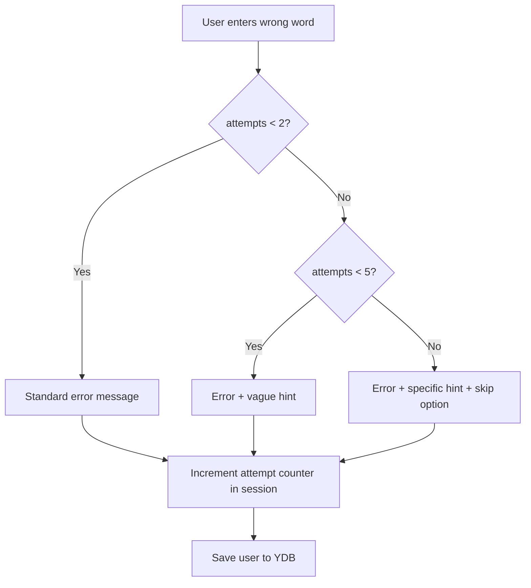

# Implementation Plan: Top 3 Funnel Improvements

## Overview

Three high-priority improvements to reduce user frustration and increase funnel completion:

1. **Centralize `secretsConfig`** — eliminate 3x code duplication and inconsistency
2. **Secret word hints** — prevent users from getting permanently stuck
3. **NeuroCoins progress display** — show earning progress at key decision points

---

## Item 1: Centralize `secretsConfig` into `constants.js`

### Problem

The secret word configuration is duplicated in 3 files with an **inconsistency**:

| Field                | `telegram_actions.js:502` | `web_chat.js:483`    | `vk_handler.js:1879` |
| -------------------- | ------------------------- | -------------------- | -------------------- |
| `WAIT_SECRET_2.next` | `"WAIT_BOT_TOKEN"`        | `"Module_3_Offline"` | `"WAIT_BOT_TOKEN"`   |

Web chat skips `WAIT_BOT_TOKEN` and goes directly to `Module_3_Offline`, while Telegram and VK point to `WAIT_BOT_TOKEN`. VK then has a runtime override (line 1923) that redirects `WAIT_BOT_TOKEN` → `Module_3_Offline`. This is fragile — the `next` field should encode the correct per-channel target from the start.

### Changes

#### 1.1 Add `SECRETS_CONFIG` to `constants.js`

```javascript
// In function_chat_bot/src/scenarios/common/constants.js

/**
 * Секретные слова для модулей
 * Каждый обработчик (TG/VK/Web) импортирует этот конфиг
 */
export const SECRETS_CONFIG = {
  WAIT_SECRET_1: {
    word: "гибрид",
    xp: 20,
    flag: "mod1_done",
    awardKey: "mod1_awarded",
    // next определяется каналом — см. getNextStateAfterSecret()
  },
  WAIT_SECRET_2: {
    word: "облако",
    xp: 30,
    flag: "mod2_done",
    awardKey: "mod2",
  },
  WAIT_SECRET_3: {
    word: "сарафан",
    xp: 40,
    flag: "mod3_done",
    awardKey: "mod3_awarded",
  },
};

/**
 * Следующий шаг после секретного слова зависит от канала
 * VK и Web не поддерживают WAIT_BOT_TOKEN
 */
export function getNextStateAfterSecret(secretState, channel) {
  if (secretState === "WAIT_SECRET_1") {
    return "Module_2_Online"; // Все каналы
  }
  if (secretState === "WAIT_SECRET_2") {
    return channel === "telegram" ? "WAIT_BOT_TOKEN" : "Module_3_Offline";
  }
  if (secretState === "WAIT_SECRET_3") {
    return "Lesson_Final_Comparison"; // Все каналы
  }
  return "Training_Main"; // fallback
}
```

#### 1.2 Update `telegram_actions.js`

- **Remove** local `secretsConfig` object (lines 502-524)
- **Import** `SECRETS_CONFIG, getNextStateAfterSecret` from `constants.js`
- **Replace** `config.next` with `getNextStateAfterSecret(u.state, "telegram")`
- **Remove** the special-case `if (config.next === "WAIT_BOT_TOKEN")` block (lines 555-566) — this logic now lives in `getNextStateAfterSecret()`. For Telegram, `WAIT_SECRET_2` returns `"WAIT_BOT_TOKEN"`, so the bot token prompt text needs to be emitted after the state transition. Move the bot token prompt text into the `WAIT_BOT_TOKEN` text in `texts.js` instead.

#### 1.3 Update `web_chat.js`

- **Remove** local `secretsConfig` object (lines 483-505)
- **Import** `SECRETS_CONFIG, getNextStateAfterSecret` from `constants.js`
- **Replace** `config.next` with `getNextStateAfterSecret(u.state, "web")`

#### 1.4 Update `vk_handler.js`

- **Remove** local `secretsConfig` object (lines 1879-1901)
- **Import** `SECRETS_CONFIG, getNextStateAfterSecret` from `constants.js`
- **Replace** `config.next` with `getNextStateAfterSecret(vkUser.state, "vk")`
- **Remove** the special-case `if (config.next === "WAIT_BOT_TOKEN")` block (lines 1923-1928) — no longer needed since `getNextStateAfterSecret("WAIT_SECRET_2", "vk")` returns `"Module_3_Offline"` directly
- **Remove** the standalone `WAIT_BOT_TOKEN` handler (lines 1941-1946) — already in `UNSUPPORTED_BY_CHANNEL` and handled by `adaptStateForChannel()`

### Testing

- `npm test` — existing tests should pass
- Manual: Telegram flow through Module 2 → verify bot token prompt appears
- Manual: VK flow through Module 2 → verify skips directly to Module 3
- Manual: Web flow through Module 2 → verify skips directly to Module 3

---

## Item 2: Secret Word Hints (After N Failed Attempts)

### Problem

When a user enters the wrong secret word, the only response is: `"❌ Неверное слово. Загляни в конец статьи еще раз..."`. There is no progressive assistance. Users can get permanently stuck.

### Design



### Changes

#### 2.1 Add hint definitions to `constants.js`

```javascript
// Add to function_chat_bot/src/scenarios/common/constants.js

export const SECRET_HINTS = {
  WAIT_SECRET_1: {
    vague:
      "💡 Подсказка: это слово связано с тем, как SetHubble объединяет онлайн и офлайн.",
    specific:
      "💡 Подсказка: слово начинается на букву «Г» и означает смешение двух разных систем в одну.",
  },
  WAIT_SECRET_2: {
    vague:
      "💡 Подсказка: это слово связано с технологией, которая работает удалённо через интернет.",
    specific:
      "💡 Подсказка: слово начинается на «О» и ассоциируется с хранением данных в интернете.",
  },
  WAIT_SECRET_3: {
    vague:
      "💡 Подсказка: это слово связано с тем, как люди передают информацию друг другу из уст в уста.",
    specific:
      "💡 Подсказка: слово начинается на «С» и это то, что работает лучше любой рекламы — рекомендации знакомых.",
  },
};

export const SECRET_MAX_ATTEMPTS_BEFORE_HINT = 2;
export const SECRET_MAX_ATTEMPTS_BEFORE_SKIP = 5;
```

#### 2.2 Add helper function to `ux_helpers.js`

```javascript
// Add to function_chat_bot/src/utils/ux_helpers.js

import {
  SECRET_HINTS,
  SECRET_MAX_ATTEMPTS_BEFORE_HINT,
  SECRET_MAX_ATTEMPTS_BEFORE_SKIP,
} from "../scenarios/common/constants.js";

/**
 * Получить текст ошибки + подсказку для секретного слова
 * @param {string} state — текущий state (WAIT_SECRET_1/2/3)
 * @param {number} attempts — количество неудачных попыток
 * @returns {string} HTML-строка сообщения
 */
export function getSecretWordErrorResponse(state, attempts) {
  const baseMsg =
    "❌ <b>Неверное слово.</b>\n\nЗагляни в конец статьи еще раз, найди правильное слово и пришли его мне.";

  if (attempts < SECRET_MAX_ATTEMPTS_BEFORE_HINT) {
    return baseMsg;
  }

  const hints = SECRET_HINTS[state];
  if (!hints) return baseMsg;

  if (attempts < SECRET_MAX_ATTEMPTS_BEFORE_SKIP) {
    return `${baseMsg}\n\n${hints.vague}`;
  }

  return `${baseMsg}\n\n${hints.specific}\n\n🔄 <i>Если не можешь найти слово — нажми кнопку «Пропустить модуль» ниже. Ты сможешь вернуться к статье позже.</i>`;
}
```

#### 2.3 Add attempt tracking to all 3 platform handlers

In each handler's secret word `else` branch (wrong word), add:

```javascript
// Track failed attempts in session
if (!u.session.secret_attempts) u.session.secret_attempts = {};
u.session.secret_attempts[u.state] =
  (u.session.secret_attempts[u.state] || 0) + 1;
await ydb.saveUser(u);

const attempts = u.session.secret_attempts[u.state];
const errorMsg = getSecretWordErrorResponse(u.state, attempts);
```

**Files to modify:**

- `telegram_actions.js` — line 571-576 (the `else` branch)
- `web_chat.js` — line 540-550 (the `else` branch)
- `vk_handler.js` — line 1933-1938 (the `else` branch)

#### 2.4 Add "Skip Module" button to secret word steps

In `telegram/buttons.js` and `vk/buttons.js`, update the button definitions for `WAIT_SECRET_1`, `WAIT_SECRET_2`, `WAIT_SECRET_3` to include a skip option:

```javascript
// Example for WAIT_SECRET_1 in telegram/buttons.js
WAIT_SECRET_1: (links, user, info) => {
  const attempts = user.session?.secret_attempts?.WAIT_SECRET_1 || 0;
  const buttons = [
    [
      {
        text: "📖 ЧИТАТЬ СТАТЬЮ",
        url: `${ACADEMY_BASE_URL}/module-1/?bot=${info?.bot_username || "sethubble_biz_bot"}`,
      },
    ],
    [{ text: "🔑 ВВЕСТИ СЕКРЕТНОЕ СЛОВО", callback_data: "ENTER_SECRET_1" }],
    [{ text: "🏠 В МЕНЮ", callback_data: "MAIN_MENU" }],
  ];

  // Show skip button after 5 failed attempts
  if (attempts >= 5) {
    buttons.splice(2, 0, [
      { text: "⏭ ПРОПУСТИТЬ МОДУЛЬ (без монет)", callback_data: "SKIP_SECRET_1" },
    ]);
  }

  return buttons;
},
```

#### 2.5 Add skip handler in all 3 platform handlers

Register new callback_data values `SKIP_SECRET_1`, `SKIP_SECRET_2`, `SKIP_SECRET_3`:

```javascript
// In each platform handler, add callback/action handler:
if (
  action === "SKIP_SECRET_1" ||
  action === "SKIP_SECRET_2" ||
  action === "SKIP_SECRET_3"
) {
  const level = action.split("_")[2]; // "1", "2", "3"
  const secretState = `WAIT_SECRET_${level}`;
  const nextState = getNextStateAfterSecret(secretState, channel);

  // Mark module as skipped (no xp awarded)
  u.session[SECRETS_CONFIG[secretState].flag] = true;
  u.session.skipped_modules = u.session.skipped_modules || [];
  u.session.skipped_modules.push(secretState);
  u.state = nextState;
  await ydb.saveUser(u);

  // Render next step with info message
  await ctx.reply(
    "⏭ <b>Модуль пропущен.</b>\n\n🪙 Монеты за этот модуль не начислены. Ты можешь вернуться к статье позже и ввести секретное слово для получения монет.\n\nПродолжаем 👇",
    { parse_mode: "HTML" },
  );
  return renderStep(ctx, nextState, token);
}
```

**Files to modify:**

- `telegram_actions.js` — add action handler near existing `ENTER_SECRET_*` handlers (around line 1325)
- `vk_handler.js` — add callback handler near existing `ENTER_SECRET_*` handlers (around line 497)
- `web_chat.js` — add callback handler near existing `ENTER_SECRET_*` handlers (around line 119)

#### 2.6 Reset attempts on successful word entry

In each handler's success branch, add:

```javascript
// Reset attempt counter on success
if (u.session.secret_attempts) {
  delete u.session.secret_attempts[u.state];
}
```

### Testing

- Enter wrong word once → standard error message
- Enter wrong word 3 times → error + vague hint
- Enter wrong word 6 times → error + specific hint + skip button appears
- Click "Skip Module" → advances without xp, module marked as skipped
- Enter correct word after skip → should not re-award xp (already handled by `xp_awarded` check)
- `npm test` — existing tests should pass

---

## Item 3: NeuroCoins Progress Display at Key Steps

### Problem

NeuroCoins balance and earning progress are only visible in a few places (`LOCKED_TRAINING_INFO`, `Lesson_Final_Comparison`, `CHESTS_INVENTORY`, `EDIT_PROFILE`). Users don't see their progress during the journey itself.

### Changes

#### 3.1 Add `getNeuroCoinsStatus()` helper to `ux_helpers.js`

```javascript
// Add to function_chat_bot/src/utils/ux_helpers.js

import { getProgressBar } from "../scenarios/common/constants.js";

/**
 * Сформировать строку баланса NeuroCoins для отображения в текстах
 * @param {object} user — объект пользователя
 * @returns {string} HTML-строка с балансом и прогрессом
 */
export function getNeuroCoinsStatus(user) {
  const xp = user.session?.xp || 0;
  const progress = Math.min((xp / 100) * 100, 100);
  const needed = Math.max(0, 100 - xp);

  if (xp >= 100) {
    return `\n🪙 <b>Баланс: ${xp} NeuroCoins</b> — Золотой Билет доступен! 🎟️\n`;
  }

  return (
    `\n🪙 <b>Баланс: ${xp}/100 NeuroCoins</b>\n` +
    `${getProgressBar(progress)}\n` +
    `Нужно ещё ${needed} 🪙 для скидки 50% на PRO\n`
  );
}
```

#### 3.2 Add balance line to MAIN_MENU text

In [`texts.js`](function_chat_bot/src/scenarios/common/texts.js), the `MAIN_MENU` function (around line 830) has 3 branches based on user status. Add `getNeuroCoinsStatus(user)` to each branch:

```javascript
// In each return branch of MAIN_MENU, append the status line.
// Example for the "Наблюдатель" branch (simplest):
return `🏠 <b>ГЛАВНОЕ МЕНЮ</b>\n\nТы находишься в режиме «Наблюдателя».\nЧтобы разблокировать инструменты заработка, тебе нужно выбрать свою стратегию.\n\n${getNeuroCoinsStatus(user)}👇 <b>С чего хочешь начать?</b>`;
```

#### 3.3 Add progress line to WAIT_SECRET step texts

Currently `WAIT_SECRET_1/2/3` don't have entries in `texts.js` — the text is generated by the module step above them. Add dynamic text that shows current balance:

```javascript
// Add to texts.js — these are shown when user is IN the secret word input state
WAIT_SECRET_1: (links, user) => {
  const xp = user.session?.xp || 0;
  return (
    `🔑 <b>ВВЕДИ СЕКРЕТНОЕ СЛОВО ИЗ МОДУЛЯ 1</b>\n\n` +
    `Прочитай статью по ссылке ниже и найди в ней секретное слово.\n\n` +
    `🪙 Награда: +20 NeuroCoins ( currently: ${xp}/100 )\n\n` +
    `<i>Пришли слово ответным сообщением:</i>`
  );
},

WAIT_SECRET_2: (links, user) => {
  const xp = user.session?.xp || 0;
  return (
    `🔑 <b>ВВЕДИ СЕКРЕТНОЕ СЛОВО ИЗ МОДУЛЯ 2</b>\n\n` +
    `Прочитай статью по ссылке ниже и найди в ней секретное слово.\n\n` +
    `🪙 Награда: +30 NeuroCoins ( currently: ${xp}/100 )\n\n` +
    `<i>Пришли слово ответным сообщением:</i>`
  );
},

WAIT_SECRET_3: (links, user) => {
  const xp = user.session?.xp || 0;
  return (
    `🔑 <b>ВВЕДИ СЕКРЕТНОЕ СЛОВО ИЗ МОДУЛЯ 3</b>\n\n` +
    `Прочитай статью по ссылке ниже и найди в ней секретное слово.\n\n` +
    `🪙 Награда: +40 NeuroCoins ( currently: ${xp}/100 )\n\n` +
    `<i>Пришли слово ответным сообщением:</i>`
  );
},
```

#### 3.4 Add balance to `Training_Main` text

The [`Training_Main`](function_chat_bot/src/scenarios/common/texts.js:136) text already shows a progress bar. Enhance it with the NeuroCoins status helper:

```javascript
Training_Main: (links, user) => {
  const theory = user.session?.theory_complete ? 10 : 0;
  const mod1 = user.session?.mod1_done ? 30 : 0;
  const mod2 = user.session?.mod2_done ? 30 : 0;
  const mod3 = user.session?.mod3_done ? 30 : 0;
  const percent = theory + mod1 + mod2 + mod3;

  return (
    `⚙️ <b>НАСТРОЙКА СИСТЕМЫ | ВВЕДЕНИЕ</b>\n${getProgressBar(percent)}\n\n` +
    `Добро пожаловать в раздел базовой настройки! Здесь ты шаг за шагом запустишь своего ИИ-клона и настроишь источники трафика.\n\n` +
    getNeuroCoinsStatus(user) +
    `Готов начать настройку?`
  );
},
```

#### 3.5 Add balance to `Theory_Reward_Spoilers` text

The [`Theory_Reward_Spoilers`](function_chat_bot/src/scenarios/common/texts.js:124) already shows xp. Enhance with the progress bar:

```javascript
Theory_Reward_Spoilers: (links, user) => {
  const xp = user.session?.xp || 10;
  return (
    `✅ <b>ВВОДНАЯ БАЗА ПРОЙДЕНА!</b>\n\n` +
    getNeuroCoinsStatus(user) +
    // ... rest of existing text (spoilers announcement)
  );
},
```

### Testing

- Verify MAIN_MENU shows balance line in all 3 user states (Наблюдатель, Агент, PRO)
- Verify WAIT_SECRET steps show current balance and reward amount
- Verify Training_Main shows progress bar + balance
- Verify Theory_Reward_Spoilers shows progress bar
- Verify balance displays correctly at 0, 50, 100+ xp
- `npm test` — existing tests should pass

---

## File Change Summary

| File                                         | Item 1                                                                                                         | Item 2                                                                                                      | Item 3                                                                               |
| -------------------------------------------- | -------------------------------------------------------------------------------------------------------------- | ----------------------------------------------------------------------------------------------------------- | ------------------------------------------------------------------------------------ |
| `src/scenarios/common/constants.js`          | Add `SECRETS_CONFIG`, `getNextStateAfterSecret()`, `SECRET_HINTS`, attempt thresholds                          | —                                                                                                           | —                                                                                    |
| `src/utils/ux_helpers.js`                    | —                                                                                                              | Add `getSecretWordErrorResponse()`                                                                          | Add `getNeuroCoinsStatus()`                                                          |
| `src/scenarios/common/texts.js`              | —                                                                                                              | —                                                                                                           | Add WAIT_SECRET_1/2/3 texts, update MAIN_MENU, Training_Main, Theory_Reward_Spoilers |
| `src/scenarios/telegram/buttons.js`          | —                                                                                                              | Add skip button to WAIT_SECRET steps                                                                        | —                                                                                    |
| `src/scenarios/vk/buttons.js`                | —                                                                                                              | Add skip button to WAIT_SECRET steps                                                                        | —                                                                                    |
| `src/platforms/telegram/telegram_actions.js` | Remove local secretsConfig, import from constants, use getNextStateAfterSecret                                 | Add attempt tracking, import getSecretWordErrorResponse, add SKIP_SECRET handler, reset attempts on success | —                                                                                    |
| `src/platforms/vk/vk_handler.js`             | Remove local secretsConfig, import from constants, use getNextStateAfterSecret, remove WAIT_BOT_TOKEN override | Add attempt tracking, import getSecretWordErrorResponse, add SKIP_SECRET handler, reset attempts on success | —                                                                                    |
| `src/core/http_handlers/web_chat.js`         | Remove local secretsConfig, import from constants, use getNextStateAfterSecret                                 | Add attempt tracking, import getSecretWordErrorResponse, add SKIP_SECRET handler, reset attempts on success | —                                                                                    |

## Implementation Order

1. **Item 1 first** — centralizing `secretsConfig` is a prerequisite for Item 2 (hints need the centralized config)
2. **Item 2 second** — secret word hints build on the centralized config
3. **Item 3 last** — NeuroCoins display is independent and can be done in parallel, but is lower urgency

## Risk Mitigation

- **Backward compatibility**: Existing users mid-funnel with `WAIT_SECRET_*` states will have `secret_attempts = undefined`, which defaults to 0 — safe.
- **YDB session size**: Adding `secret_attempts` and `skipped_modules` to session adds minimal data (< 200 bytes).
- **Skip abuse**: Skipping awards no xp, so users who skip all modules reach `Lesson_Final_Comparison` with only 10 xp (from theory) — they see the full-price PRO offer, which is the intended deterrent.
