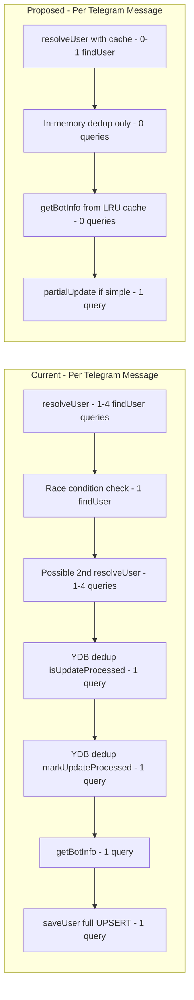

# NeuroGen Platform — Optimization Plan

**Date:** 2026-04-30  
**Scope:** `function_chat_bot/` — DB query reduction, omnichannel preservation, SaaS stability  
**Goal:** Reduce YDB queries by ~60-70% while maintaining full omnichannel functionality

---

## Executive Summary

Current state: **Every user interaction triggers 3-10+ YDB queries.** The main bottlenecks are:

1. **Telegram middleware** — 2-8+ DB queries per message for user resolution + race condition check
2. **No caching** — `getBotInfo()` hits DB on every call (16+ call sites)
3. **Full UPSERT on every save** — `saveUser()` writes all 28 columns even when only `state` changed
4. **Triple deduplication** — In-memory Map + LRU cache + YDB `processed_updates` table (3 layers doing the same job)
5. **`saveUser()` jitter delay** — 10-50ms artificial delay on EVERY save adds latency
6. **`isOwnerAiActive()`** — Up to 3 sequential DB queries per AI request

---

## Architecture Overview — Current vs Proposed



---

## Priority 1 — High Impact, Low Risk

### 1.1 Add LRU Cache for `getBotInfo()`

**Problem:** [`getBotInfo()`](function_chat_bot/ydb_helper.js:552) is called at 16+ sites across the codebase with NO caching. Bot info rarely changes — only when partner registers/updates their bot.

**Current query count:** 1 DB query per call × 16+ call sites  
**Proposed:** 0 DB queries after cache hit (TTL: 5 min)

**Implementation:**
- Add an LRU cache in `ydb_helper.js` with TTL=300000ms (5 min), max=50 entries
- Wrap `getBotInfo()` and `getBotInfoByVkGroup()` to check cache first
- Invalidate cache in `registerPartnerBot()` and `updatePartnerBot()`
- Cache key: bot token or vk_group_id string

**Files to modify:**
- [`ydb_helper.js`](function_chat_bot/ydb_helper.js) — add cache wrapper around `getBotInfo()` / `getBotInfoByVkGroup()`

**Estimated query reduction:** ~5-10 queries per minute in active usage

---

### 1.2 Remove YDB Deduplication Layer — Keep Only In-Memory

**Problem:** Triple deduplication is redundant:
1. `processedUpdates` Map in [`index.js:91`](function_chat_bot/index.js:91)
2. `updateCache` LRU cache from [`ttl_cache.js`](function_chat_bot/src/utils/ttl_cache.js)
3. YDB `processed_updates` table via [`isUpdateProcessed()`](function_chat_bot/ydb_helper.js:1086) + [`markUpdateProcessed()`](function_chat_bot/ydb_helper.js:1109)

In a serverless environment, YDB deduplication adds 2 queries per webhook but doesn't guarantee correctness anyway (race condition between check and mark). The in-memory LRU cache is sufficient for the typical 1-2 second duplicate window from Telegram.

**Current query count:** 2 DB queries per Telegram webhook  
**Proposed:** 0 DB queries — rely on in-memory LRU cache only

**Implementation:**
- Remove `isUpdateProcessed()` and `markUpdateProcessed()` calls from [`index.js`](function_chat_bot/index.js:1266-1274)
- Keep the `updateCache` LRU cache as the sole dedup mechanism
- Remove `processedUpdates` Map (redundant with LRU cache)
- Keep YDB `processed_updates` table schema for now (no breaking change) but stop writing to it
- Optionally: keep `cleanupProcessedUpdates()` as a no-op or remove entirely

**Files to modify:**
- [`index.js`](function_chat_bot/index.js) — remove YDB dedup calls, remove `processedUpdates` Map

**Estimated query reduction:** 2 queries per Telegram webhook

---

### 1.3 Remove `saveUser()` Jitter Delay

**Problem:** [`saveUser()`](function_chat_bot/ydb_helper.js:325) adds 10-50ms random delay before EVERY save:
```js
await new Promise(res => setTimeout(res, 10 + Math.random() * 40));
```

This was added to "spread load" but in a serverless environment with low concurrency per container, it only adds latency. The retry logic with exponential backoff already handles `RESOURCE_EXHAUSTED` errors.

**Current impact:** 10-50ms added to every `saveUser()` call  
**Proposed:** Remove the delay entirely; rely on retry logic for contention

**Files to modify:**
- [`ydb_helper.js`](function_chat_bot/ydb_helper.js:325) — remove the jitter line

---

### 1.4 Add `partialUpdateUser()` for Common Cases

**Problem:** [`saveUser()`](function_chat_bot/ydb_helper.js:314) UPSERTs all 28 columns every time, even when only `state` + `session_version` changed. This is the #1 DB write amplifier.

**Current query cost:** Full UPSERT of 28 columns × ~50 saveUser calls across VK handler alone  
**Proposed:** Lightweight `partialUpdateUser()` for state-only changes

**Implementation:**
- New function `partialUpdateUser(userId, fields)` that UPDATEs only specified columns
- Use it in the most frequent patterns:
  - State transitions: UPDATE only `state`, `session_version`, `last_seen`
  - AI count increment: UPDATE only `session`, `session_version`
  - Last seen only: already handled by `batchUpdateLastSeen()`
- Keep `saveUser()` for full creates and major updates
- Add `session_version` optimistic concurrency check

**Example query:**
```sql
DECLARE $id AS Utf8;
DECLARE $st AS Utf8;
DECLARE $sv AS Uint64;
DECLARE $ls AS Uint64;
UPDATE users SET state = $st, session_version = $sv, last_seen = $ls
WHERE id = $id AND session_version = $sv - 1;
```

**Files to modify:**
- [`ydb_helper.js`](function_chat_bot/ydb_helper.js) — add `partialUpdateUser()`
- [`telegram_actions.js`](function_chat_bot/src/platforms/telegram/telegram_actions.js) — use partial update for state transitions
- [`vk_handler.js`](function_chat_bot/src/platforms/vk/vk_handler.js) — use partial update for state transitions
- [`web_chat.js`](function_chat_bot/src/core/http_handlers/web_chat.js) — use partial update where `needsSave` flag is used

**Estimated query reduction:** ~30-40% less data written per save operation

---

## Priority 2 — Medium Impact, Medium Risk

### 2.1 Optimize Telegram Middleware — Eliminate Race Condition Check

**Problem:** [`telegram_setup.js`](function_chat_bot/src/platforms/telegram/telegram_setup.js:136-168) middleware does:
1. `resolveUser('telegram', ...)` — 1-4 parallel `findUser` queries
2. `findUser({tg_id})` — 1 more query for race condition check
3. If duplicate found → `resolveUser('telegram', ...)` AGAIN — 1-4 more queries

**Total: 2-9 DB queries just for user resolution per message**

**Root cause:** The race condition happens when two webhooks arrive simultaneously for the same user. The current "check after resolve" approach is fundamentally flawed — by the time you check, another request may have already created a duplicate.

**Proposed solution:**
- Remove the post-resolve race condition check entirely
- Instead, add a short-lived in-memory user cache (TTL=30s) keyed by `tg_id`
- If user was resolved in the last 30 seconds, reuse the cached result
- This eliminates 1-5 DB queries per message for returning users

**Implementation:**
```js
// In telegram_setup.js or a shared cache module
const recentUserCache = new LRUCache({ max: 500, ttl: 30000 });

bot.use(async (ctx, next) => {
  const tgId = Number(ctx.from.id);
  
  // Check cache first
  const cached = recentUserCache.get(String(tgId));
  if (cached) {
    ctx.dbUser = cached;
    return next();
  }
  
  let user = await resolveUser('telegram', { tg_id: tgId, ... });
  // ... existing logic WITHOUT the race condition check ...
  
  recentUserCache.set(String(tgId), user);
  ctx.dbUser = user;
  await next();
});
```

**Files to modify:**
- [`telegram_setup.js`](function_chat_bot/src/platforms/telegram/telegram_setup.js) — remove race condition check, add user cache

**Estimated query reduction:** 1-5 queries per Telegram message

---

### 2.2 Optimize `resolveUser()` — Single Query with OR

**Problem:** [`resolveUser()`](function_chat_bot/src/core/omni_resolver.js:52) makes parallel `findUser` calls for each ID type. Each `findUser` is a separate YDB query using a secondary index.

**Current:** Up to 4 parallel queries (tg_id, vk_id, web_id, email)  
**Proposed:** Single query with OR conditions using a composite approach

**Implementation option A — Single query:**
```sql
DECLARE $tg_id AS Uint64;
DECLARE $vk_id AS Uint64;
DECLARE $web_id AS Utf8;
DECLARE $email AS Utf8;
SELECT * FROM users WHERE tg_id = $tg_id OR vk_id = $vk_id OR web_id = $web_id OR email = $email;
```
Note: This may not use indexes efficiently in YDB. Need to benchmark.

**Implementation option B — Smart resolution order:**
For Telegram: only search by `tg_id` (1 query)  
For VK: only search by `vk_id` (1 query)  
For Web: search by `web_id` first, then `email` only if provided (1-2 queries)  
Cross-channel linking happens AFTER initial resolution via the merge flow

This is safer and more predictable. The current approach of always searching all 4 channels is overkill — when a Telegram message arrives, we primarily need `tg_id`.

**Files to modify:**
- [`omni_resolver.js`](function_chat_bot/src/core/omni_resolver.js) — channel-aware search strategy

**Estimated query reduction:** 2-3 queries per resolution (from 4 to 1-2)

---

### 2.3 Add User Session Cache

**Problem:** Every request resolves the user from DB. For active users in a conversation, this means repeated full-row reads.

**Proposed:** LRU cache for user objects, keyed by primary channel ID

**Implementation:**
- Add `userCache` LRU (max=200, TTL=60s) in a shared module
- Check cache before `findUser()` in `resolveUser()`
- Invalidate on `saveUser()` and `mergeUsers()`
- Cache key: `tg:<id>`, `vk:<id>`, `web:<id>`, `email:<addr>`

**Risk:** Stale data if user is modified from another channel simultaneously. Mitigated by:
- Short TTL (60s)
- Cache invalidation on save
- Omnichannel merge still works because it always reads from DB

**Files to modify:**
- New file: `src/utils/user_cache.js`
- [`omni_resolver.js`](function_chat_bot/src/core/omni_resolver.js) — check cache first
- [`ydb_helper.js`](function_chat_bot/ydb_helper.js) — invalidate on save/merge

**Estimated query reduction:** 1-4 queries per repeated user interaction

---

### 2.4 Optimize `isOwnerAiActive()` — Cache + Single Query

**Problem:** [`isOwnerAiActive()`](function_chat_bot/ydb_helper.js:981) makes up to 3 sequential DB queries:
1. `getBotInfo(botToken)` — find owner by bot token
2. `getBotInfoByVkGroup(vkGroupId)` — find owner by VK group
3. `getUser(ownerId)` — check owner's `ai_active_until`

With `getBotInfo` caching (1.1), queries 1 and 2 become cache hits. But query 3 still hits DB every time.

**Proposed:**
- After implementing getBotInfo cache (1.1), only query 3 remains
- Add a dedicated query that gets `ai_active_until` directly from the owner without loading the full user object:
```sql
DECLARE $owner_id AS Utf8;
SELECT ai_active_until FROM users WHERE id = $owner_id;
```
- Cache the result with TTL=60s (AI subscription status doesn't change mid-request)

**Files to modify:**
- [`ydb_helper.js`](function_chat_bot/ydb_helper.js) — add `getOwnerAiStatus()` lightweight query, add caching

**Estimated query reduction:** 2-3 queries per AI request → 0-1 with caching

---

## Priority 3 — Lower Impact, Architectural Improvements

### 3.1 Optimize CRM API Queries

**Problem:** [`crm_api.js`](function_chat_bot/src/core/http_handlers/crm_api.js:65) makes 3 parallel queries per CRM data request:
1. `getPartnerUsersCount()`
2. `getUsersByPartner()`
3. `getPartnerStatsByFunnel()`

Plus `findUser()` for partner lookup and `getBotInfo()` for auth.

**Proposed:**
- Combine count + stats into a single query (they both scan the same index)
- `getBotInfo()` will be cached after 1.1
- Add pagination cursor-based approach instead of OFFSET (which is slow on large tables)

**Files to modify:**
- [`crm_api.js`](function_chat_bot/src/core/http_handlers/crm_api.js) — merge queries
- [`ydb_helper.js`](function_chat_bot/ydb_helper.js) — add combined stats query

---

### 3.2 Optimize Payment Webhook — Parallel Lookups

**Problem:** [`payment_webhook.js`](function_chat_bot/src/core/http_handlers/payment_webhook.js) does sequential `findUser` calls:
1. First by `tg_id`
2. Then by `email` if not found

**Proposed:** Parallel lookups with `Promise.all`:
```js
const [byTgId, byEmail] = await Promise.all([
  ids.tg_id ? ydb.findUser({ tg_id: ids.tg_id }) : null,
  ids.email ? ydb.findUser({ email: ids.email }) : null,
]);
```

**Files to modify:**
- [`payment_webhook.js`](function_chat_bot/src/core/http_handlers/payment_webhook.js) — parallel lookups

---

### 3.3 Session Data Diet — Reduce JSON Payload

**Problem:** The `session` JSON column stores everything: `dialog_history`, `channels`, `channel_states`, `tags`, `xp`, `ai_count`, etc. This blob grows over time and is written in full on every `saveUser()`.

**Proposed:**
- Move `dialog_history` to a separate storage or limit more aggressively (currently capped at 20, could be 10)
- Move `channel_states` to a separate column or table
- Keep `session` lean: only `tags`, `xp`, `ai_count`, and current step metadata
- This reduces the JSON serialization/deserialization cost and the data written per UPSERT

**Files to modify:**
- [`ydb_helper.js`](function_chat_bot/ydb_helper.js) — schema evolution
- [`ydb_schema.sql`](function_chat_bot/ydb_schema.sql) — add `dialog_history` column
- All handlers that read/write `session.dialog_history`

---

### 3.4 VK Handler — Reduce saveUser Calls

**Problem:** [`vk_handler.js`](function_chat_bot/src/platforms/vk/vk_handler.js) has 40+ `saveUser()` calls — many in rapid succession within the same request. Some are unavoidable (state transitions), but some are redundant.

**Proposed:**
- Adopt the `needsSave` pattern from [`web_chat.js`](function_chat_bot/src/core/http_handlers/web_chat.js) (already uses it)
- Batch state changes and save once at the end of request processing
- Use `partialUpdateUser()` from 1.4 for simple state changes

**Files to modify:**
- [`vk_handler.js`](function_chat_bot/src/platforms/vk/vk_handler.js) — consolidate save calls

---

### 3.5 Connection Pool Tuning

**Problem:** Current pool settings in [`ydb_helper.js:32-36`](function_chat_bot/ydb_helper.js:32):
```js
poolSettings: {
  minLimit: 1,
  maxLimit: 10,
  keepAlivePeriod: 30000
}
```

In serverless with low concurrency, `maxLimit: 10` may be too high (wastes resources). But during CRON runs with 200 users, it may be too low.

**Proposed:**
- Reduce `maxLimit` to 5 for normal operation
- Consider dynamic pool sizing or separate pool for CRON
- Increase `keepAlivePeriod` to 60000ms to reduce keepalive traffic

**Files to modify:**
- [`ydb_helper.js`](function_chat_bot/ydb_helper.js) — tune pool settings

---

## Query Reduction Summary

| Flow | Current Queries | After Optimization | Reduction |
|------|----------------|-------------------|-----------|
| Telegram message | 5-10+ | 1-2 | ~75% |
| VK message | 3-6 | 1-2 | ~65% |
| Web chat request | 2-5 | 1-2 | ~55% |
| CRM API request | 5-7 | 1-3 | ~55% |
| Payment webhook | 3-5 | 1-2 | ~55% |
| CRON run (200 users) | 200-400 | 50-100 | ~65% |
| AI request | 4-7 | 0-2 | ~70% |

---

## Omnichannel Preservation Checklist

All optimizations MUST preserve these omnichannel guarantees:

- [ ] User with `tg_id` + `email` resolves to single profile
- [ ] User with `vk_id` + `web_id` resolves to single profile
- [ ] Cross-channel merge works when new ID is discovered
- [ ] `mergeUsers()` audit trail in `user_merges` table is preserved
- [ ] `session.channels` tracks all configured channels per user
- [ ] Channel state (`channel_states`) is preserved per channel
- [ ] `getPrimaryChannel()` returns correct channel after cache hit
- [ ] Cache invalidation on merge prevents stale data
- [ ] Race condition handling still works (via in-memory cache + YDB UPSERT idempotency)

---

## Implementation Order

The items are ordered by impact-to-risk ratio:

1. **1.1** — getBotInfo LRU cache (highest impact, zero risk)
2. **1.2** — Remove YDB dedup layer (high impact, low risk)
3. **1.3** — Remove saveUser jitter (trivial change, immediate latency win)
4. **2.4** — isOwnerAiActive optimization (depends on 1.1)
5. **2.1** — Telegram middleware user cache (medium risk, needs testing)
6. **2.2** — resolveUser smart search (medium risk, needs testing)
7. **1.4** — partialUpdateUser (high value but touches many files)
8. **2.3** — User session cache (depends on 2.1 and 2.2)
9. **3.2** — Payment webhook parallel lookups (trivial)
10. **3.1** — CRM API query merge (medium effort)
11. **3.4** — VK handler saveUser consolidation (tedious but straightforward)
12. **3.3** — Session data diet (schema change, needs migration)
13. **3.5** — Connection pool tuning (needs load testing)

---

## Testing Strategy

After each optimization step:

1. **Unit tests:** `npm test` in `function_chat_bot/`
2. **Manual smoke test:** Send Telegram message → verify response
3. **VK smoke test:** Send VK message → verify response  
4. **Web chat test:** Open web chat → verify funnel flow
5. **CRM test:** Open CRM dashboard → verify data loads
6. **Omnichannel test:** 
   - Create user via web → link Telegram → verify single profile
   - Create user via VK → add email → verify merge
7. **Check logs:** `yc serverless function logs --function-name sethubble-bot --tail 50`
8. **Monitor YDB consumption:** Check read/write unit counts in Yandex Cloud console
