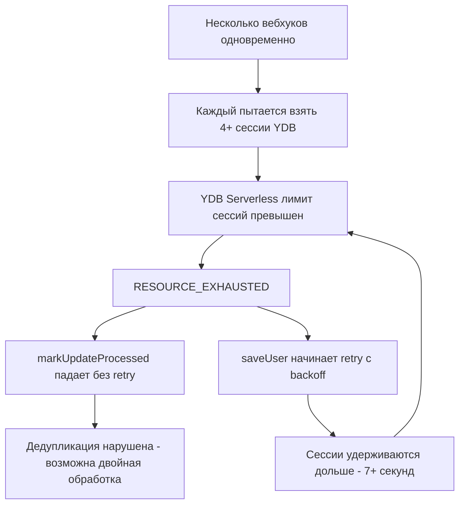

# Анализ: RESOURCE_EXHAUSTED в YDB при обработке вебхуков

## Что происходит в логах

Хронология событий (UTC+8, 30 апреля):

| Время | Событие |
|-------|---------|
| 14:04:33 | Запрос `1d7c01c8` — обработка, 2734ms |
| 14:04:50 | Запрос `b7b6bb04` — Telegram вебхук |
| 14:04:50 | `[PROCESSED UPDATES] Mark failed: 8 RESOURCE_EXHAUSTED` |
| 14:04:51–53 | `[saveUser] Transient error, retry 1/4 → 2/4 → 3/4` |
| 14:04:57 | Запрос завершён — **7025ms** из-за ретраев |
| 14:05:34–40 | Ещё 4 запроса одновременно (VK + Telegram) |

## Корневая причина: каскадная исчерпация сессий YDB

### Проблема 1: Telegram вебхук использует 4+ YDB сессий подряд

Для **одного** Telegram вебхука код в [`index.js:1265-1274`](function_chat_bot/index.js:1265) выполняет:

```
1. isUpdateProcessed()  → SELECT from processed_updates  → сессия #1
2. markUpdateProcessed() → UPSERT into processed_updates → сессия #2
3. getUser()            → SELECT from users              → сессия #3
4. saveUser()           → UPSERT into users              → сессия #4 (× до 4 ретраев!)
```

Каждый вызов `driver.tableClient.withSession()` захватывает сессию из пула.

### Проблема 2: VK использует in-memory Map, а Telegram — YDB

**VK** — [`vk_handler.js:717-725`](function_chat_bot/src/platforms/vk/vk_handler.js:717):
```javascript
// Ноль запросов к YDB для дедупликации!
if (processedUpdates.has(vkUpdateId)) return;
processedUpdates.set(vkUpdateId, Date.now());
```

**Telegram** — [`index.js:1267-1274`](function_chat_bot/index.js:1267):
```javascript
// 2 лишних запроса к YDB для дедупликации
const isAlreadyProcessed = await ydb.isUpdateProcessed(String(body.update_id));
await ydb.markUpdateProcessed(String(body.update_id));
```

### Проблема 3: markUpdateProcessed НЕ имеет retry-логики

[`ydb_helper.js:1297-1317`](function_chat_bot/ydb_helper.js:1297) — при RESOURCE_EXHAUSTED просто логирует warning и возвращает `false`:

```javascript
} catch (e) {
  log.warn(`[PROCESSED UPDATES] Mark failed: ${e.message}`);
  return false;  // ← Нет retry! Дедупликация нарушена
}
```

Тогда как [`saveUser`](function_chat_bot/ydb_helper.js:334) имеет полный retry с exponential backoff (4 попытки, 400ms base).

### Проблема 4: Каскадный эффект



### Проблема 5: Пул сессий vs Serverless

Настройки пула в [`ydb_helper.js:38-42`](function_chat_bot/ydb_helper.js:38):
```javascript
poolSettings: {
  minLimit: 1,
  maxLimit: 10,     // 10 сессий на контейнер
}
```

YDB Serverless имеет **глобальный лимит** на количество одновременных сессий к БД (~20-50 в зависимости от тарифа). При 3+ параллельных контейнерах с `maxLimit: 10` каждый, суммарно запрашивается 30+ сессий — превышение лимита гарантировано.

## Рекомендации

### 1. ⭐ Заменить YDB-дедупликацию Telegram на in-memory (как у VK)

Наибольший выигрыш: **-2 YDB сессии на каждый вебхук**. В serverless-окружении с одним контейнером in-memory Map/TTL-кэш достаточно для окна дедупликации в 5 минут.

Уже существует `updateCache` — [`ttl_cache.js`](function_chat_bot/src/utils/ttl_cache.js) и `processedUpdates` Map — [`index.js:91`](function_chat_bot/index.js:91), но для Telegram они не используются!

### 2. Объединить isUpdateProcessed + markUpdateProcessed в одну атомарную операцию

Если YDB-дедупликация всё же нужна, заменить 2 запроса на 1 conditional UPSERT:

```sql
UPSERT INTO processed_updates (update_id, processed_at, expire_at)
VALUES ($uid, $processed_at, $expire_at)
ON CONFLICT (update_id) DO NOTHING;
-- Проверить affectedRows чтобы понять, была ли запись уже
```

Это сокращает с 2 сессий до 1.

### 3. Добавить retry в markUpdateProcessed

Если функция остаётся, она должна иметь такую же retry-логику как `saveUser`, иначе дедупликация ненадёжна.

### 4. Снизить maxLimit пула сессий

При `maxLimit: 10` и 3+ контейнерах = 30+ сессий. Рекомендуется `maxLimit: 5` или даже `3`, чтобы не исчерпать глобальный лимит YDB Serverless.

### 5. Оптимизировать горячий путь: getUser + saveUser в одну сессию

Сейчас `getUser` и `saveUser` вызываются последовательно, каждый захватывая свою сессию. Можно объединить в `withSession` callback.

## Приоритет исправлений

| # | Исправление | Экономия сессий | Сложность |
|---|-------------|-----------------|-----------|
| 1 | In-memory дедуп для Telegram | -2 на вебхук | Низкая |
| 2 | Снизить maxLimit до 5 | Профилактика | Минимальная |
| 3 | Retry в markUpdateProcessed | Надёжность | Низкая |
| 4 | Атомарный is+mark UPSERT | -1 на вебхук | Средняя |
| 5 | Объединить getUser+saveUser | -1 на вебхук | Высокая |
