# 🚀 NeuroGen Sales Funnel & Telegram Bot Scenarios — Deep Dive

## Overview

The NeuroGen bot implements a **69-step onboarding and monetization funnel** spanning 3 user personas with converging paths, theory + practical training blocks, gamification via NeuroCoins, a Tripwire/PRO offer, multi-channel setup, and extended follow-up sequences.

---

## 1. Funnel Architecture (69 Steps)

### 1.1 Persona Selection (`Start_Choice`)

All users enter here and choose one of 3 paths:

```
┌─────────────────────────────────────────────────────────────┐
│                        START                                 │
│                        │                                     │
│                   Start_Choice                               │
│                    │     │       │                           │
│            ┌───────┘     │       └───────┐                   │
│            ▼             ▼               ▼                   │
│       Agent_1_Pain  Business_     Business_                   │
│                     Offline_Pain  Online_Pain                 │
│            │             │               │                    │
│     ┌──────┴──────┐     ▼               ▼                    │
│     ▼             ▼     Solution →  Solution →               │
│  Agent_2_    Agent_2_   Case →        Case →                 │
│  Offline     Online     Parachute                             │
│     │             │        │               │                  │
│     ▼             ▼        ▼               ▼                  │
│  Case_Anton   Agent_Math   └───→  Pre_Training_Logic  ←──────┘
│     │             │                       │                   │
│     └──────┬──────┘                       ▼                   │
│            └──────────────→          Registration Gate        │
└─────────────────────────────────────────────────────────────┘
```

- **Agent** (earn from zero): `Agent_1_Pain` → offline/online subpath → case/math → converge
- **Business_Offline** (offline business pain): pain → solution → case (Elena) → parachute → converge
- **Business_Online** (online business pain): pain → solution → case (Max) → converge
- **AntiMLM**: MLM/scam rebuttal → redirects back to Agent or Business_Offline

### 1.2 Registration Gate (`Pre_Training_Logic`)

All 3 personas converge here. User must register on SetHubble platform.

```
Pre_Training_Logic
       │
       ▼
WAIT_REG_ID ──→ WAIT_REG_TAIL ──→ WAIT_VERIFICATION
       │
       ▼
WAIT_FUNNEL_EMAIL ──→ WAIT_SECRET_1 ──→ WAIT_SECRET_2 ──→ WAIT_SECRET_3
       │
       ▼
WAIT_SH_ID_P ──→ WAIT_SH_TAIL_P ──→ WAIT_PARTNER_REG ──→ WAIT_BOT_TOKEN
       │
       ▼
SETUP_BOT_START ──→ CONFIRM_BOT_DATA
       │
       ▼
CHANNEL_SETUP_TG ──→ MULTI_CHANNEL_TG ──→ WAIT_TG_SETUP ──→ WAIT_EMAIL_INPUT
```

The registration waits are **input-based**: user must type their SetHubble ID, tail, verification code, email, bot token, etc.

### 1.3 Theory Block (5 Modules + Reward)

```
Theory_Mod1 → Theory_Mod2 → Theory_Mod3 → Theory_Mod4 → Theory_Mod5
                                                                    │
                                                                    ▼
                                                        Theory_Reward_Spoilers
                                                            (+10 🪙 NeuroCoins)
```

- Free educational content about partner marketing, offline/online business
- Completion grants 10 NeuroCoins (xp)
- Spoilers tease what comes next

### 1.4 Practical Training (3 Modules)

```
Training_Main
    │
    ├──→ Theory_Mod1 (10% intro - already done)
    │
    └──→ Module_1_Strategy
            │
            ▼
        Module_2_Online
            │
            ▼
        Module_2_Reward_PromoKit (opens WebApp with promo materials)
            │
            ▼
        Module_3_Offline
            │
            ▼
        Lesson_Final_Comparison
```

- **Module 1**: Strategy article on academy site
- **Module 2**: Online business setup + Promo-Kit WebApp (with JWT auth)
- **Module 3**: Offline business setup
- Each module has a **secret word** gate (`ENTER_SECRET_1/2/3`) that must be found in the article
- Completion unlocks **B2B Knowledge Base PDF** (otherwise locked with `LOCKED_B2B_INFO`)

### 1.5 Tripwire / PRO Offer

```
Lesson_Final_Comparison
    │
    ▼
Offer_Tripwire ($20 with 100🪙 / $40 without)
    │
    ├──→ FAQ_PRO (questions about PRO)
    ├──→ Tripwire_Features (features list)
    └──→ Tripwire_Math (ROI breakdown)
            │
            ▼
        Delivery_1 (first delivery after purchase)
            │
            ▼
        Training_Pro_Main ←──── begins PRO track
```

#### NeuroCoins Gamification Logic

Defined in [`function_chat_bot/src/scenarios/telegram/buttons.js`](function_chat_bot/src/scenarios/telegram/buttons.js:442):

```javascript
Lesson_Final_Comparison: (links, user) => {
  const xp = user.session?.xp || 0;
  if (xp >= 100) {
    // Show 50% off button: "ОБМЕНЯТЬ 100 🪙 НА PRO (-50%)" → $20
  } else {
    // Show full price: "АКТИВИРОВАТЬ PRO ($40)"
  }
};
```

### 1.6 PRO Training Track

```
Training_Pro_Main
    │
    ├──→ Training_Pro_P1_1 → P1_2 → P1_3 → P1_4 → P1_5
    ├──→ Training_Pro_P2_1 → P2_2 → P2_3 → P2_4
    │
    ▼
Training_Bot_Success → Token_Success
```

- Part 1 (5 steps): Bot setup and configuration
- Part 2 (4 steps): Advanced bot features
- Final: Bot deployment success + token activation

### 1.7 Upgrade Offers (Rocket / Shuttle)

```
Rocket_Limits (Rocket $85/yr)
    │
    ▼
Shuttle_Offer (Shuttle $350/yr)
    │
    ▼
UPGRADE_CONFIRMED
```

- **Rocket**: $85/yr — higher limits
- **Shuttle**: $350/yr — top tier, highest limits

---

## 2. Monetization Tiers

| Tier               | Price   | Commission | Key Features                                 |
| ------------------ | ------- | ---------- | -------------------------------------------- |
| **FREE**           | $0      | 31%        | Basic bot, 3 AI req/day, locked PRO features |
| **PRO** (Tripwire) | $20-$40 | higher     | Full training, all modules, CRM, promo kit   |
| **Rocket**         | $85/yr  | higher     | Increased limits                             |
| **Shuttle**        | $350/yr | highest    | Top tier                                     |

Defined in [`function_chat_bot/src/scenarios/common/constants.js`](function_chat_bot/src/scenarios/common/constants.js:5-10):

```javascript
export const TRIPWIRE_PRICE = process.env.TRIPWIRE_PRICE || "20";
export const TRIPWIRE_BASE_PRICE = process.env.TRIPWIRE_BASE_PRICE || "40";
export const ROCKET_PRICE = process.env.ROCKET_PRICE || "85";
export const SHUTTLE_PRICE = process.env.SHUTTLE_PRICE || "350";
```

Product IDs from [`function_chat_bot/index.js`](function_chat_bot/index.js:1):

- `PRODUCT_ID_FREE = "140_9d5d2"`
- `PRODUCT_ID_PRO = "103_97999"`

---

## 3. Follow-Up / Dozhim System

After Delivery_1, the system sends automated follow-ups:

### Tripwire Follow-Ups (10 messages)

```
FollowUp_Tripwire_1 through FollowUp_Tripwire_10
```

- Sent at spaced intervals after `DOZHIM_DELAY_HOURS = 20` (20h)
- Re-engage users who haven't purchased PRO

### Plan Follow-Ups (10 messages)

```
FollowUp_Plan_1 through FollowUp_Plan_10
```

- For PRO users, upsell to Rocket or Shuttle

### Reminder System

For users who **left mid-funnel**:

```
REMINDER_1H → REMINDER_3H → REMINDER_24H → REMINDER_48H
```

For users who **left after being reminded** (resume gate):

```
RESUME_GATE → REMINDER_1H_RESUME → REMINDER_3H_RESUME
           → REMINDER_24H_RESUME → REMINDER_48H_RESUME → RESUME_LAST
```

The timer is defined in [`function_chat_bot/index.js`](function_chat_bot/index.js:530) via `DOZHIM_MAP` and `REMIND_MAP`.

---

## 4. Navigation & Locked Sections

### MAIN_MENU (3 Dynamic Variants)

From [`function_chat_bot/src/scenarios/common/texts.js`](function_chat_bot/src/scenarios/common/texts.js:784):

```javascript
MAIN_MENU: (links, user, info) => {
  if (user.bought_tripwire) {
    return "...PRO variant..."; // PRO menu: full access
  }
  if (hasData) {
    return "...partner variant..."; // Partner menu
  }
  return "...beginner variant..."; // Beginner menu
};
```

3 variants based on user status:

1. **PRO** (`bought_tripwire = true`): Full access to all features
2. **Partner** (has active partner data): Partner-specific options
3. **Beginner** (default): Basic navigation

### Locked Sections (Gated by PRO)

| State                      | Content                                                                           |
| -------------------------- | --------------------------------------------------------------------------------- |
| `LOCKED_B2B_INFO`          | B2B Knowledge Base PDF (unlocked after Module 3 or PRO)                           |
| `LOCKED_TRAINING_INFO`     | Advanced training (locked until PRO)                                              |
| `LOCKED_CRM_INFO`          | CRM dashboard preview (shows pseudo-random "lost profit" based on user_id + date) |
| `LOCKED_PRO_TRAINING_INFO` | PRO training track (locked until PRO purchase)                                    |
| `LOCKED_PLANS_INFO`        | Upgrade plans (locked)                                                            |
| `LOCKED_CRM`               | CRM tool (locked)                                                                 |
| `LOCKED_PROMO`             | Promo materials (locked)                                                          |
| `LOCKED_KNOWLEDGE`         | Knowledge base (locked)                                                           |
| `LOCKED_AI_APPS`           | AI apps (locked)                                                                  |

The "lost profit" mechanic in `LOCKED_CRM_INFO` generates a fake revenue loss based on the user's ID + current date, creating urgency.

### Utility States

- **ACADEMY_MENU**: Browse academy content
- **EDIT_PROFILE**: View/edit user profile
- **CHESTS_INVENTORY**: View NeuroCoins and items inventory
- **SUPPORT_ASK**: Contact support

---

## 5. Multi-Channel Setup Flow

After registration, the bot guides through connecting additional channels:

```
MULTI_CHANNEL_SELECT
    │
    ├──→ CHANNEL_SETUP_TG → WAIT_TG_SETUP
    ├──→ CHANNEL_SETUP_VK → CHANNEL_SETUP_Success
    ├──→ CHANNEL_SETUP_WEB → CHANNEL_SETUP_Success
    └──→ CHANNEL_SETUP_EMAIL → WAIT_EMAIL_INPUT → CHANNEL_SETUP_Success
                                    │
                                    ▼
                          CHANNEL_SETUP_COMPLETE
```

From [`function_chat_bot/src/scenarios/telegram/buttons.js`](function_chat_bot/src/scenarios/telegram/buttons.js:560):

- Shows only **unconfigured** channels
- Channel state tracked in `user.session.channels[channel].configured`
- Auto-detected channels (e.g., Telegram from tg_id) are already marked configured

---

## 6. Scenario Assembly Architecture

### Scaffolding

[`function_chat_bot/src/scenarios/scenario_tg.js`](function_chat_bot/src/scenarios/scenario_tg.js:10-21):

```javascript
function buildSteps() {
  const steps = {};
  for (const key of Object.keys(texts)) {
    steps[key] = {
      text: texts[key], // from texts.js
      buttons: telegramButtons[key] || null, // from buttons.js
      image: stepMeta[key]?.image || null, // from step_meta.js
      tag: stepMeta[key]?.tag || null, // for analytics/filtering
    };
  }
  return steps;
}
```

### 3 Files → 1 Scenario Module

| File                                                                  | Purpose                              | Examples                                                          |
| --------------------------------------------------------------------- | ------------------------------------ | ----------------------------------------------------------------- |
| [`texts.js`](function_chat_bot/src/scenarios/common/texts.js)         | All funnel text content (1056 lines) | Dynamic `(links, user, info) => string` functions                 |
| [`buttons.js`](function_chat_bot/src/scenarios/telegram/buttons.js)   | Inline keyboards (1720 lines)        | Static arrays or dynamic `(links, user, info) => array` functions |
| [`step_meta.js`](function_chat_bot/src/scenarios/common/step_meta.js) | Metadata (images, tags)              | Image URLs, analytics tags                                        |

### Channel Compatibility

[`step_order.js`](function_chat_bot/src/scenarios/common/step_order.js:76-96) defines states **unsupported** per channel:

```javascript
const UNSUPPORTED_BY_CHANNEL = {
   telegram: [],
   vk: ["WAIT_BOT_TOKEN", "SETUP_BOT_START", "CONFIRM_BOT_DATA", ...],
   web: ["WAIT_BOT_TOKEN", "SETUP_BOT_START", ...],
   email: [],
};
```

Key functions:

- [`isStateSupported(state, channel)`](function_chat_bot/src/scenarios/common/step_order.js:98) — Check if state works on channel
- [`getNextSupportedState(state, channel)`](function_chat_bot/src/scenarios/common/step_order.js:103) — Find next valid state
- [`adaptStateForChannel(user, channel)`](function_chat_bot/src/scenarios/common/step_order.js:113) — Auto-adapt user's state to channel
- [`getFunnelIndex(state)`](function_chat_bot/src/scenarios/common/step_order.js:71) — Used by `omni_resolver.js` for main profile selection (highest index = most advanced)

---

## 7. Deep Link System

[`deeplink.js`](function_chat_bot/src/scenarios/common/deeplink.js):

```javascript
buildStartPayload(user) → encodes partner_id + email/web_id
parseStartPayload(payload) → decodes back to { partnerId, email, webId }
```

Used for referral tracking — when user clicks a referral link, the bot identifies the referrer.

---

## 8. Key Integration Points

### With `index.js`

The funnel states are used by [`sendStepToUser`](function_chat_bot/index.js:677) to dispatch messages:

1. Lookup user's current `state`
2. Lookup `steps[state]` from scenario module
3. Call `text` function with `(links, user, info)` → get message text
4. Call `buttons` function with same params → get inline keyboard
5. Send via channel-specific method (Telegram API, VK API, etc.)

### With `ydb_helper.js`

- `saveUser(user)` / `partialUpdateUser(userId, fields)` — Save user state after each step
- `getBotUsers(botToken)` — Get all users of a bot for CRON follow-ups
- `getStaleUsers(hoursAgo)` — Find users who haven't responded for follow-ups

### With `omni_resolver.js`

- `getFunnelIndex(state)` determines which profile is "primary" during merge
- Higher funnel index = more advanced user = survives the merge

### With CRON Jobs

From [`function_chat_bot/src/core/http_handlers/cron_jobs.js`](function_chat_bot/src/core/http_handlers/cron_jobs.js):

- Periodically fetches stale users (`getStaleUsers`)
- Sends follow-up messages (`FollowUp_Tripwire_N`, `FollowUp_Plan_N`)
- Sends reminders (`REMINDER_1H/3H/24H/48H`)
- Limits: `CRON_MAX_USERS_PER_RUN = 200`
- Delay: `DOZHIM_DELAY_HOURS = 20`

---

## 9. Complete Funnel Flow Diagram

```mermaid
flowchart TB
    START --> Start_Choice

    subgraph Persona_Selection["Persona Selection"]
        Start_Choice -->|Agent| Agent_1_Pain
        Start_Choice -->|Business Online| Business_Online_Pain
        Start_Choice -->|Business Offline| Business_Offline_Pain
        Start_Choice -->|AntiMLM| AntiMLM
        AntiMLM --> Agent_1_Pain
        AntiMLM --> Business_Offline_Pain

        Agent_1_Pain -->|Offline| Agent_2_Offline
        Agent_1_Pain -->|Online| Agent_2_Online
        Agent_2_Offline --> Agent_3_Case_Anton
        Agent_2_Online --> Agent_Math
    end

    Agent_3_Case_Anton --> Pre_Training_Logic
    Agent_Math --> Pre_Training_Logic
    Business_Offline_Pain --> Business_Offline_Solution
    Business_Offline_Solution --> Business_Offline_Case
    Business_Offline_Case --> Business_Offline_Parachute
    Business_Offline_Parachute --> Pre_Training_Logic
    Business_Online_Pain --> Business_Online_Solution
    Business_Online_Solution --> Business_Online_Case
    Business_Online_Case --> Pre_Training_Logic

    subgraph Registration["Registration Gate"]
        Pre_Training_Logic --> WAIT_REG_ID
        WAIT_REG_ID --> WAIT_REG_TAIL
        WAIT_REG_TAIL --> WAIT_VERIFICATION
        WAIT_VERIFICATION --> WAIT_FUNNEL_EMAIL
        WAIT_FUNNEL_EMAIL --> WAIT_SECRET_1
        WAIT_SECRET_1 --> WAIT_SECRET_2
        WAIT_SECRET_2 --> WAIT_SECRET_3
        WAIT_SECRET_3 --> WAIT_SH_ID_P
        WAIT_SH_ID_P --> WAIT_SH_TAIL_P
        WAIT_SH_TAIL_P --> WAIT_PARTNER_REG
        WAIT_PARTNER_REG --> WAIT_BOT_TOKEN
        WAIT_BOT_TOKEN --> SETUP_BOT_START
        SETUP_BOT_START --> CONFIRM_BOT_DATA
        CONFIRM_BOT_DATA --> CHANNEL_SETUP_TG
        CHANNEL_SETUP_TG --> MULTI_CHANNEL_TG
        MULTI_CHANNEL_TG --> WAIT_TG_SETUP
        WAIT_TG_SETUP --> WAIT_EMAIL_INPUT
    end

    WAIT_EMAIL_INPUT --> Theory_Mod1

    subgraph Theory["Theory Block 5 Modules"]
        Theory_Mod1 --> Theory_Mod2
        Theory_Mod2 --> Theory_Mod3
        Theory_Mod3 --> Theory_Mod4
        Theory_Mod4 --> Theory_Mod5
        Theory_Mod5 --> Theory_Reward_Spoilers
    end

    Theory_Reward_Spoilers --> Training_Main

    subgraph Training["Practical Training"]
        Training_Main --> Module_1_Strategy
        Module_1_Strategy --> Module_2_Online
        Module_2_Online --> Module_2_Reward_PromoKit
        Module_2_Reward_PromoKit --> Module_3_Offline
        Module_3_Offline --> Lesson_Final_Comparison
    end

    Lesson_Final_Comparison -->|Has 100 NeuroCoins| Offer_Tripwire_20
    Lesson_Final_Comparison -->|No discount| Offer_Tripwire_40

    subgraph Offer["Tripwire PRO Offer $20/$40"]
        Offer_Tripwire_20 --> FAQ_PRO
        Offer_Tripwire_40 --> FAQ_PRO
        FAQ_PRO --> Payment
        Payment --> Delivery_1
    end

    subgraph Pro_Training["PRO Training Track"]
        Delivery_1 --> Training_Pro_Main
        Training_Pro_Main --> Training_Pro_P1_1
        Training_Pro_P1_1 --> Training_Pro_P1_2
        Training_Pro_P1_2 --> Training_Pro_P1_3
        Training_Pro_P1_3 --> Training_Pro_P1_4
        Training_Pro_P1_4 --> Training_Pro_P1_5
        Training_Pro_P1_5 --> Training_Pro_P2_1
        Training_Pro_P2_1 --> Training_Pro_P2_2
        Training_Pro_P2_2 --> Training_Pro_P2_3
        Training_Pro_P2_3 --> Training_Pro_P2_4
        Training_Pro_P2_4 --> Training_Bot_Success
        Training_Bot_Success --> Token_Success
    end

    subgraph Upgrades["Rocket $85 / Shuttle $350"]
        Token_Success --> Rocket_Limits
        Rocket_Limits --> Shuttle_Offer
        Shuttle_Offer --> UPGRADE_CONFIRMED
    end

    subgraph FollowUps["Automated Follow-ups 20 messages"]
        Delivery_1 -.->|CRON 20h delay| FollowUp_Tripwire_1
        FollowUp_Tripwire_1 -.-> FollowUp_Tripwire_10
        UPGRADE_CONFIRMED -.-> FollowUp_Plan_1
        FollowUp_Plan_1 -.-> FollowUp_Plan_10
    end

    subgraph Reminders["Reminder System"]
        Any_State -.->|1h idle| REMINDER_1H
        REMINDER_1H -.->|3h idle| REMINDER_3H
        REMINDER_3H -.->|24h idle| REMINDER_24H
        REMINDER_24H -.->|48h idle| REMINDER_48H
    end
```



---

## 10. Summary of Key Technical Details

| Aspect                    | Detail                                                                            |
| ------------------------- | --------------------------------------------------------------------------------- |
| **Total funnel steps**    | 69 (in [`step_order.js`](function_chat_bot/src/scenarios/common/step_order.js))   |
| **Text content**          | 1056 lines in [`texts.js`](function_chat_bot/src/scenarios/common/texts.js)       |
| **Telegram buttons**      | 1720 lines in [`buttons.js`](function_chat_bot/src/scenarios/telegram/buttons.js) |
| **User personas**         | 3 (Agent, Business_Online, Business_Offline)                                      |
| **Monetization tiers**    | 4 (FREE/PRO/Rocket/Shuttle)                                                       |
| **Follow-up messages**    | 20 (10 Tripwire + 10 Plan)                                                        |
| **Reminder variants**     | 4 (1h/3h/24h/48h) + resume variants                                               |
| **Channel compatibility** | VK = 8 unsupported states, Web = 5 unsupported states                             |
| **Gamification**          | NeuroCoins (xp), secret words, chests inventory                                   |
| **Locked sections**       | 9 gated states that unlock with PRO or module completion                          |
| **Multi-channel**         | 4 channels (TG/VK/Web/Email) + auto-detect + manual setup                         |
