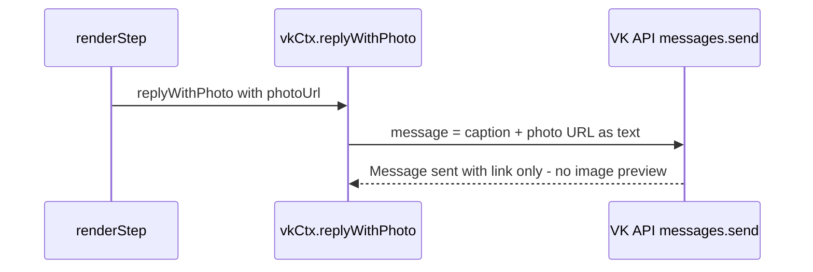
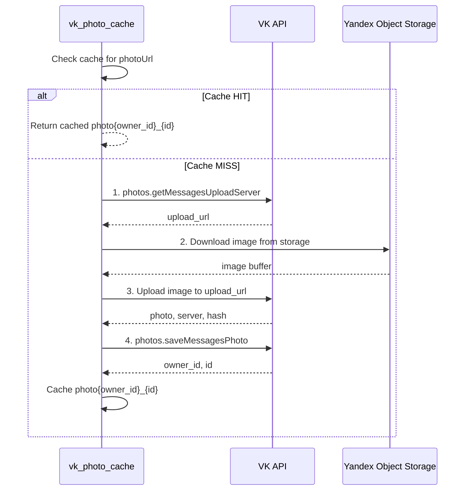

# VK Chat: Fix Image Display (Links Instead of Images)

## Problem

In the VK chat, images are displayed as plain text links instead of rendered images. 

**Root cause**: The `replyWithPhoto()` method in [`vk_handler.js`](../function_chat_bot/src/platforms/vk/vk_handler.js:440) does NOT actually upload photos to VK. It just appends the image URL as text:

```javascript
params.append("message", `${captionText}\n\n📷 Фото: ${photoUrl}`);
```

This relied on VK auto-generating a link preview from the URL — a feature VK **no longer supports** for image URLs in messages.

## Current Flow



## Solution: VK Photo Upload with Caching

VK requires a 3-step upload process to display images as actual photo attachments:



## Implementation Plan

### 1. Create `function_chat_bot/src/utils/vk_photo_cache.js`

New utility module with:

- **In-memory Map** cache: `Map<string, {attachment: string, timestamp: number}>`
  - Key = image URL
  - Value = VK attachment string like `photo12345_67890`
  - TTL = 24 hours (images are static, rarely change)
  - Max entries = 50 (limited number of step images)

- **`uploadPhotoToVk(photoUrl, groupToken)`** function:
  1. Call `photos.getMessagesUploadServer` with `group_token` and `v=5.199`
  2. Fetch the image from `photoUrl` (Yandex Object Storage) as ArrayBuffer
  3. POST the image to the `upload_url` as multipart/form-data (field name: `photo`)
  4. Call `photos.saveMessagesPhoto` with `server`, `photo`, `hash` from step 3
  5. Return `photo{owner_id}_{id}` attachment string

- **`getVkPhotoAttachment(photoUrl, groupToken)`** function:
  1. Check cache for `photoUrl`
  2. If cached and not expired → return cached attachment string
  3. If not cached → call `uploadPhotoToVk`, cache result, return it
  4. On any error → return `null` (caller falls back to link)

- **Multipart upload**: Since this is a Node.js serverless function without `form-data` npm package, we will construct the multipart body manually using `Buffer` and boundary delimiters. This avoids adding new dependencies.

### 2. Update `replyWithPhoto` in `message_event` handler (~line 440)

```javascript
replyWithPhoto: async (photoUrl, opts = {}) => {
  let captionText = opts.caption || "";
  captionText = captionText.replace(/<[^>]*>?/gm, "");

  const params = new URLSearchParams();
  params.append("access_token", process.env.VK_GROUP_TOKEN);
  params.append("v", "5.199");
  params.append("user_id", String(userId));
  params.append("random_id", String(Math.floor(Math.random() * 2147483647)));

  // Try to upload photo to VK for proper display
  const attachment = await getVkPhotoAttachment(photoUrl, process.env.VK_GROUP_TOKEN);
  
  if (attachment) {
    params.append("attachment", attachment);
    params.append("message", captionText);
  } else {
    // Fallback: link in text if upload failed
    params.append("message", `${captionText}\n\n📷 Фото: ${photoUrl}`);
  }

  // ... keyboard logic unchanged ...
}
```

### 3. Update `replyWithPhoto` in `message_new` handler (~line 927)

Same logic as above, but using `message.from_id` for `user_id`.

### 4. Error handling and fallback

- If `photos.getMessagesUploadServer` fails → fallback to link
- If image download from storage fails → fallback to link  
- If upload to VK fails → fallback to link
- If `photos.saveMessagesPhoto` fails → fallback to link
- All errors logged with `[VK PHOTO UPLOAD]` prefix
- Cache write only on success

### 5. Performance considerations

- **Cold start**: First request for each image will be slower (~2-3s for upload flow)
- **Warm requests**: Cached attachments make it instant (just `messages.send` with `attachment`)
- **Serverless constraint**: The 5-second Yandex Cloud function timeout is not an issue because:
  - Images are cached after first upload
  - Even first upload should complete in ~2-3s
  - The `replyWithPhoto` is called AFTER the main logic, not blocking webhook response

### 6. Files to modify

| File | Change |
|------|--------|
| `function_chat_bot/src/utils/vk_photo_cache.js` | **NEW** — upload + cache utility |
| `function_chat_bot/src/platforms/vk/vk_handler.js` | Import `getVkPhotoAttachment`, update both `replyWithPhoto` implementations |

### 7. No new dependencies required

The multipart form upload will be constructed manually using Node.js built-in `Buffer` and `fetch`. No `form-data` or `multipart` npm packages needed.
